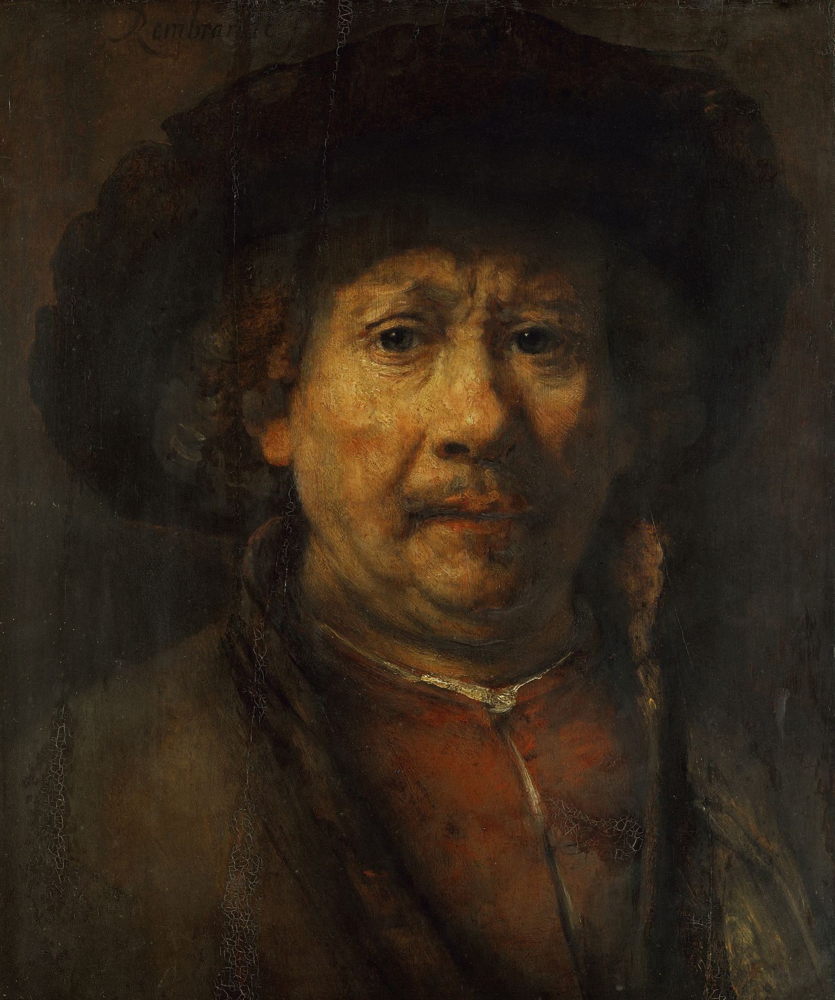

# Rembrandt (v2)

## Overview

Rembrandt is a [Discord](https://discord.com/) bot that helps teach your server about art history and appreciation. It will periodically send the server random paintings, artifacts and sculptures within the [Metropolitan Museum of Art](https://www.metmuseum.org/) collection with accompanying information on the piece.

## Running the bot locally

...

## Commands

| Command      | Options            | Notes                                                                                                                      |
| ------------ | ------------------ | -------------------------------------------------------------------------------------------------------------------------- |
| /art         | none               | Artwork will be picked at random                                                                                           |
| /search      | query              | Searches _fuzzily_ (see "query inaccuracy" note below) for an object in the Met collection that matches the query provided |
| /subscribe   | channel (required) | Must be a text channel. This signs your discord up for daily updates                                                       |
| /unsubscribe | none               | Unsubscribes from daily updates                                                                                            |

## Technologies

...

## Notes

### Query inaccuracy

This bot tends to be rather "fuzzy" when querying for art. There's two things that make it rather difficult at the moment to generate highly accurate searches:

1. The MET API just generally returns a ton of artwork for queries, even if it's only barely accurate. For example the query "birdhouse" will return birdhouses, birds, and houses; the query "waterfall" will return artwork depicting majestic waterfalls _and_ people falling from various structures.
2. The bot picks an image at random from the returned artwork. Even if the first few results are highly accurate, the bot will pick one at random in order to keep things interesting for the end user.

I have ways that I think I can improve this over time, but I intend to leave the querying/searching functionality somewhat fuzzy as I think it makes things more fun in the end.
